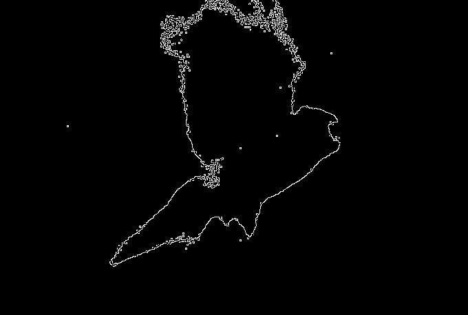
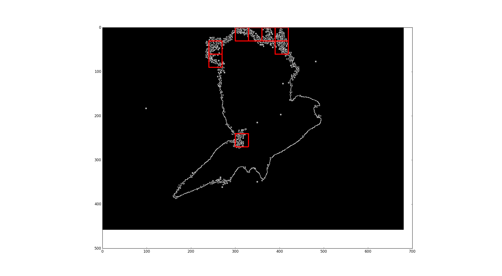

# Smoke-Flow-Analysis

This is a study of flapping flight analysis of birds and understanding the high vibration zones of the birds wings and other body parts. 
Part of undergrad project of analyzing the flapping flight mechanism of birds. 
The study was done in a wind tunnel ensuring laminar flow. 
The laminarity was assessed through DIP. 

Necessary dependencies:  
1. numpy
2. cv2
3. matplotlib

